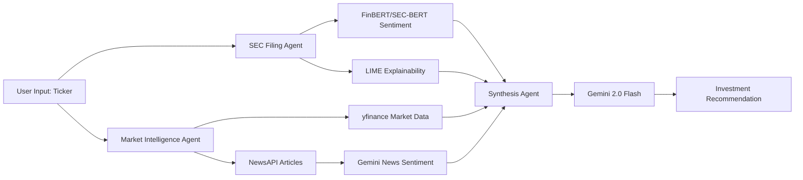

# 📊 Financial Research Agent

[](https://www.python.org/downloads/)
[](https://opensource.org/licenses/MIT)
[](https://huggingface.co/spaces/Sanchi10/financial-research-agent)

**Multi-agent equity analysis combining SEC filings with real-time market intelligence**

🔗 **[Try Live Demo →](https://huggingface.co/spaces/Sanchi10/financial-research-agent)**

---

## 🎯 What This Does

A production-grade financial analysis system that combines:
- **Domain-specific ML models** (FinBERT, SEC-BERT) for fundamental analysis
- **Gemini 2.0 Flash** for intelligent synthesis and reasoning
- **LIME explainability** to show which words drive predictions
- **Multi-agent orchestration** for comprehensive equity research

### Architecture Flow



**Agent Pipeline:**
1. **SEC Filing Agent**: Analyzes 10-K/10-Q/8-K filings with FinBERT + SEC-BERT, extracts actual risk sentences
2. **Market Intelligence Agent**: Gathers real-time price data, technicals (RSI/MACD), and news with Gemini-powered sentiment
3. **Synthesis Agent**: Gemini 2.0 Flash cross-references fundamentals vs. market action for final recommendation

## 🚀 How to Use

1. Enter a stock ticker (e.g., TSLA, AAPL, RBLX)
2. Optionally add company name for better news search
3. Select SEC filing type (10-K for annual, 10-Q for quarterly)
4. Click **Analyze**
5. Wait ~1-2 minutes for comprehensive analysis

## 🔬 What Makes This Different

Unlike basic sentiment tools, this platform:
- ✅ **Hybrid Intelligence**: Combines domain-specific ML (FinBERT/SEC-BERT) with LLM reasoning (Gemini 2.0 Flash)
- ✅ **Explainable AI**: LIME shows which words drive sentiment predictions
- ✅ **Actual SEC Filings**: Extracts real risk sentences from 10-K/10-Q/8-K, not generic summaries
- ✅ **Cross-Validation**: What companies say (filings) vs. what markets do (price/news)
- ✅ **Deterministic**: Reproducible results with fixed random seeds for consistent analysis

## ⚙️ Configuration

**Required Environment Variables:**
- `SEC_EMAIL`: Your email (SEC EDGAR compliance)
- `NEWS_API_KEY`: NewsAPI key ([get free tier](https://newsapi.org/))
- `GEMINI_API_KEY`: Google Gemini API key ([get free tier](https://aistudio.google.com/app/apikey))

**Note**:
- First run downloads ML models (~500MB) - subsequent analyses are much faster
- Without Gemini API key, falls back to rule-based synthesis (less sophisticated)

## 🛠️ Tech Stack

**AI/ML:**
- **Domain-Specific Models**: FinBERT, SEC-BERT (financial sentiment analysis)
- **LLM**: Gemini 2.0 Flash (synthesis and reasoning)
- **Explainability**: LIME (Local Interpretable Model-agnostic Explanations)

**Data Sources:**
- SEC EDGAR (official filings)
- yfinance (market data)
- NewsAPI (news sentiment)

**Infrastructure:**
- **Framework**: Custom multi-agent orchestration
- **Interface**: Gradio 5.0+
- **Deployment**: Hugging Face Spaces
- **Language**: Python 3.10+

## ✨ Key Features

- 📄 **Multi-Filing Support**: Analyze 10-K (annual), 10-Q (quarterly), or 8-K (current) reports
- 🧠 **Hybrid AI**: Domain-specific models + LLM reasoning for best of both worlds
- 🔍 **Explainable Results**: See which words influenced sentiment predictions
- 📊 **Comprehensive Analysis**: Fundamental (SEC) + Technical (RSI/MACD) + News sentiment
- 🎯 **Risk Extraction**: Extracts actual risk sentences from filings, not generic summaries
- 🔄 **Deterministic**: Same ticker = same results (reproducible with fixed seeds)

## 📝 Limitations

- SEC filings updated quarterly/annually (not real-time)
- NewsAPI free tier: 100 requests/day
- First analysis takes longer (model download ~500MB)
- Analysis time: 1-3 minutes depending on data availability
- yfinance may occasionally face rate limiting

## 🚀 Local Development

```bash
# Clone repository
git clone https://github.com/SanchitSharma10/financial-research-agent.git
cd financial-research-agent

# Install dependencies
pip install -r requirements.txt

# Set environment variables
export SEC_EMAIL="your@email.com"
export NEWS_API_KEY="your_newsapi_key"
export GEMINI_API_KEY="your_gemini_key"  # Optional

# Run locally
python app.py
```

Visit `http://localhost:7860` in your browser.

## 🔗 Links

- **Live Demo**: [Hugging Face Spaces](https://huggingface.co/spaces/Sanchi10/financial-research-agent)
- **GitHub**: [SanchitSharma10/financial-research-agent](https://github.com/SanchitSharma10/financial-research-agent)
- **Author**: [Sanchit Sharma](https://linkedin.com/in/sanchit-sharma10)

---

## ⚠️ Important Disclaimer

**This tool is for research and educational purposes only. NOT financial advice.**

- Do not make investment decisions based solely on this analysis
- Always conduct your own due diligence and consult with financial professionals
- Past performance does not guarantee future results
- The creators assume no liability for financial decisions made using this tool

## 📄 License

MIT License - See [LICENSE](LICENSE) file